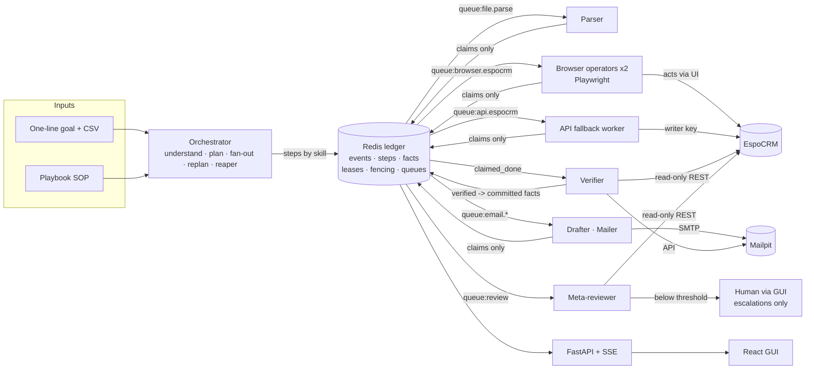
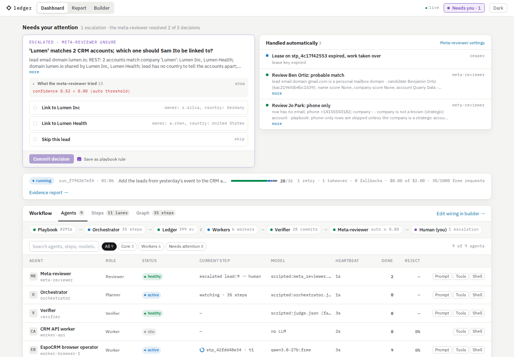
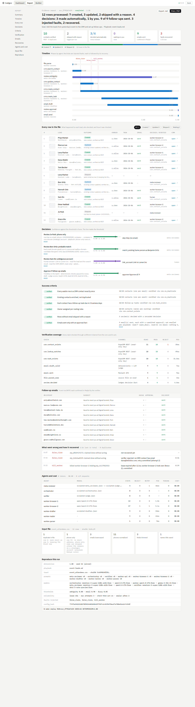

# Ledger: submission for the CentrAlign AI Founding Engineer problem

| Requirement | Where |
|---|---|
| Source code | https://github.com/jash-maester/centralign-ai-role-submission |
| Setup and run instructions | [`README.md`](../README.md) |
| Architecture | [§1](#1-architecture) |
| Technical and design decisions | [§2](#2-technical-and-design-decisions) |
| Demo video / live demo | [§3](#3-demo) · [`demo/`](demo/) · [`screenshots/`](screenshots/) |
| Known limitations | [§4](#4-known-limitations) |
| What I would build next | [§5](#5-what-i-would-build-next) |
| Assumptions | [§6](#6-assumptions) |
| Models, APIs, frameworks, services, pre-built components | [§7](#7-models-apis-frameworks-and-services-used) |
| Redeploying, keys and requirements | [`README.md`](../README.md#requirements) and [`HANDOFF.md`](../HANDOFF.md) |

## The problem as I read it

Humans stay in the loop with today's agents for three reasons: agents are
unreliable, they cannot prove they finished, and they act irreversibly on ambiguous
requests. Better prompts do not remove any of these. A coordination substrate does,
and pre-LLM distributed systems already know how to build one: a single log of
committed state, leases with fencing, and a separation between *saying* work is done
and *proving* it.

Ledger is that substrate, demonstrated on one realistic workflow: *"Add the leads from
yesterday's event to the CRM and set up follow-ups."* The request is one line; a
playbook (company context as an SOP) supplies everything unstated: dedupe rules, owner
routing, follow-up policy, what needs approval, what the reviewer may decide alone.

| The brief asks the system to... | Where it happens in Ledger |
|---|---|
| Understand the intended outcome | Orchestrator expands goal + playbook into checkable success criteria |
| Determine and plan actions | Step graph; every step carries a postcondition from a registry |
| Select tools | Routing by agent card (skills); the orchestrator never names a worker |
| Execute | Parser, browser operators, API fallback, drafter, mailer |
| Observe | Every action emits observation events to the ledger |
| Adapt / recover | Retry with the rejection reason, replan, lease takeover, model fallback |
| Maintain state | Redis ledger: runs, steps, facts, append-only events |
| Ask for input or approval | Meta-reviewer decides above threshold; escalates only the rest |
| Verify completion | Independent verifier, deterministic checks first, different channel |
| Return evidence | Evidence report: records, screenshots, decisions, recoveries, cost |

## 1. Architecture



**Services** (one `docker compose up`): `redis` (ledger, AOF on) · `api` (FastAPI, SSE,
agent config, chaos, sandboxed shell bridge) · `orchestrator` · `verifier` ·
`meta-reviewer` · `worker-parser` · `worker-browser-1/2` (Playwright, own image) ·
`worker-api` (CRM REST fallback) · `worker-drafter` · `worker-mailer` · `espocrm` +
`espocrm-db` (the company system) · `mailpit` (SMTP sink) · `web` (nginx + React) ·
`seed` (one-shot). All Python services share one package, `ledger_core`, and differ
only by entrypoint.

**The ledger** (`services/core/ledger_core/ledger.py`, keys in `keys.py`): an
append-only event stream (`ledger:events`), run and step hashes, committed facts per
run, lease keys and monotonic fencing counters per step, and one Redis Stream queue
per skill with consumer groups. Every state change appends an event; replaying the
events rebuilds every step's status (tested).

**Step state machine** (`protocol.py`, enforced atomically in `ledger.py`):

```
planned -> ready -> leased -> claimed_done -> verified -> committed
                      |            +-> rejected -> ready (retry, with the reason) | replanned
                      +-> lease_expired -> ready            (takeover)
                      +-> review_required -> ready | input_required -> ready
any non-terminal -> dead (max attempts -> handed to a human)
```

Rules that make it correct:

1. Only the verifier can move a step to `verified`/`committed`; workers can only reach
   `claimed_done`. Illegal transitions raise.
2. Facts are written only at commit, and worker prompts are built only from committed
   facts, so an unverified claim can never poison another agent's context.
3. Every worker write carries its fencing token; a write with a stale token is rejected
   and logged. A worker that wakes up after its lease expired cannot corrupt state.
4. Side-effecting steps are check-then-act: the worker first checks whether the
   postcondition already holds and claims done without acting if it does. This is
   what makes a takeover idempotent.

**Verification** (`postconditions.py`, `checks/`, `verifier.py`): a registry of named
checks (`crm.contact_exists`, `crm.no_duplicate`, `crm.task_exists`,
`crm.lookup_matches`, `email.draft_valid`, `email.sent`, `file.parsed_rows`,
`review.decided`, `run.criteria_met`). Deterministic checks run first; an LLM judge
(different model family from the workers) is used only for email tone. Workers act
through the browser; the verifier reads through REST with a **read-only** CRM API key
enforced by an EspoCRM role. One broken channel cannot both act wrongly and report
success.

**Self-healing**, each visible as distinct events: retry (the rejection reason goes
into the next prompt) → replan (move a lane from the UI path to the API skill after
N rejections) → takeover (lease expiry, reaper requeues, higher fencing token) → model
fallback (next model in the role's list) → hand-off to a human when a lane dies.

**Humans by exception** (`meta_reviewer.py`): ambiguous rows and email approvals become
review steps. The meta-reviewer gathers evidence read-only (CRM REST, playbook,
committed facts), asks its model for a decision with a confidence, and commits it if
confidence ≥ threshold (0.80 ambiguity, 0.90 email). Below threshold the step becomes
`input_required` with options and what it tried; it blocks only its own lane. A human
answer becomes a committed fact and can be saved as a playbook rule.

**Protocol**: an A2A-shaped subset carried over Redis Streams: agent cards with skills,
task envelopes with state and fencing token, `input-required` as a task state,
artifacts as claims. A real A2A HTTP facade could be added without touching agents.

**GUI** (`web/`): Dashboard (needs your attention, run strip, agents/steps/graph, run
controls, criteria, live ledger), Report (printable evidence report, markdown export),
Builder (node canvas of agents around the ledger, animated from live events). One SSE
connection per run drives a single store.

Full detail: [`plans/01-architecture.md`](../plans/01-architecture.md) (spec + notes on
every deliberate deviation made during the build).

## 2. Technical and design decisions

| Decision | Choice | Why |
|---|---|---|
| Core idea | Shared verified ledger, not a smarter agent | Reliability comes from state and verification, which compose; prompting does not |
| Commit rule | Workers claim, only the verifier commits | "Done" must be proven against the world, not asserted |
| Verification channel | Act via browser, verify via REST (read-only key) | Independent channels catch both fabricated claims and broken actions |
| Failure model | Leases (15 s TTL, heartbeat every TTL/3), fencing tokens, reaper | Any worker can die at any point; takeover must not duplicate side effects |
| Idempotency | Check-then-act on every side-effecting step + idempotency keys | Makes retries and takeovers safe without CRM-side transactions |
| Context for agents | Prompts rebuilt each attempt from committed facts + playbook sections + prior rejection reasons | No chat history between agents; a bad claim cannot propagate |
| Human in the loop | Meta-reviewer with confidence thresholds; escalate only below | Approvals should not stall a run; humans see only real ambiguity |
| Planning | LLM for understand/plan; deterministic code for fan-out, dependency release, routing | Spend model calls only where judgment is needed; the rest must be predictable |
| Store | Redis 7 (Streams, hashes, Lua for atomic transitions/leases, AOF) | Leases/TTL native, one container, fast enough; durability via AOF |
| No agent framework | Own coordination layer in ~plain Python | The coordination layer is the point; frameworks hide exactly what this project is about |
| LLM access | OpenRouter, models by role from env, fallback lists | One key, many model families; the verifier/judge uses a different family than workers |
| Free models first | `:free` models + response cache + budget from OpenRouter's key endpoint + reserve | Built within a 50-requests/day budget; switching to paid is config only |
| Determinism | One 0..1 setting maps to per-role temperature (verifier always 0) + pinned seed + cache | Reproducible demos and replays even when a provider ignores the seed |
| Offline mode | `LLM_BACKEND=scripted` replays recorded structured answers | Deterministic tests and demos without spending budget; same code paths |
| Browser control | Playwright with roles/labels, screenshots before/after as evidence | Deterministic and auditable; LLM only picks among observed candidates or recovery actions |
| CRM / email | EspoCRM (real UI + REST) and Mailpit | A real system with a real UI and API, nothing leaves the laptop |
| Packaging | Everything in docker compose, `make` targets, per-worktree project/ports | One command to run; parallel stacks for development and testing |
| Tests | Real Redis/CRM/Mailpit in containers, no mocks for infrastructure | The invariants (no duplicates, fencing, commit-only-by-verifier) only mean something against the real thing |

How it was built: I wrote the plans first (`plans/`), then the foundation (compose stack,
seed, shared contracts) by hand, then built the rest with Claude Code as parallel tracks
in git worktrees. After each wave an integration gate merged the tracks, ran the full
suites and the phase's acceptance checks, and an independent verifier re-ran everything
looking for faked tests; failures were fixed at the root before the next wave. The gates
caught real integration bugs that unit tests could not (for example, the meta-reviewer
read the approval step in a different shape than the drafter wrote it, so no email could
ever be sent).

## 3. Demo

- **[`demo/demo-walkthrough.mp4`](demo/demo-walkthrough.mp4)** (3:08, 1080p, captions, no
  voiceover): one continuous real take of a run driven through the GUI. Builder (one-line
  goal → Run, agents animating around the ledger) → Dashboard (steps, criteria, live
  ledger) → **false claim injected**: the verifier rejects it ("no CRM contact has email
  omar@brightline.co") and the retry commits → **browser worker killed** while holding a
  lease: the reaper expires the lease and worker-browser-2 takes over with fencing token 2
  → step drawers showing both attempts → the Sam Ito escalation (what the meta-reviewer
  tried, 0.52 < 0.80) answered with "save as playbook rule" → Mailpit inbox → evidence
  report (every row, decisions, what went wrong and how it recovered, reproduce block).
  Long waits are sped up (marked "N× speed"). Recorded on the deterministic scripted
  backend; the same flow on live models is described under
  [Live run on real models](#live-run-on-real-models).
- **Screenshots** of a real run driven by the GUI test (`make test-gui`):
  [`screenshots/`](screenshots/), in order: Builder goal → running → Dashboard progress
  → false claim rejected → kill-worker takeover → agent restarted → determinism 1.0 →
  Sam Ito escalation → what the meta-reviewer tried → answered → settled Dashboard →
  Report.
- **Live:** follow the [README](../README.md#run-it); a full run takes about 1-2 minutes.




### Live run on real models

On 2026-10-04 (15:37-15:41 IST) the full demo ran on live OpenRouter free models with
`LLM_CACHE=off`, through the browser path and every service (`make demo
LLM_BACKEND=openrouter`). The ledger's `llm.call` events record **28 live calls, none
cached**: orchestrator 2 and meta-reviewer 3 on `nvidia/nemotron-3-super-120b-a12b:free`,
drafter 12 on `qwen/qwen3.8-27b:free`, verifier/LLM judge 9 on Nemotron, plus 2 calls to
the fallback `google/gemma-4-31b-it:free` that its provider rate-limited (HTTP 429),
which exercised the fallback path for real. Outcome, in 3 min 40 s: the model wrote its
own success criteria from the goal and playbook; 6 contacts created, 3 updated, 2
skipped with a reason, 9 follow-up tasks, 8 drafts valid, 8 emails sent with an approval
fact, Jo Park skipped by the meta-reviewer (0.95), and only Sam Ito escalated: the same
result as the deterministic demo.

## 4. Known limitations

- **Postconditions must be writable.** Fuzzy outcomes (email tone) fall back to an LLM
  judge; its verdict and reasoning are recorded, but it is a model's opinion.
- **Selector-based browser control is brittle against UI changes.** The operator uses
  roles/labels and recovers from unexpected pages with a small fixed set of actions;
  the replanner can move a lane to the REST skill. Vision-based computer use is future work.
- **Check-then-act is not atomic against an external system.** A narrow race remains
  between "check" and "act" without CRM-side idempotency keys.
- **Playbook quality is the ceiling.** The planner can produce a wrong-but-verifiable
  plan; criteria come from the playbook.
- **Redis is a single point of failure** (AOF persistence, no replication).
- **A confident wrong decision by the meta-reviewer** is possible; the verifier still
  checks outcomes and every auto decision is in the report with its evidence.
- **Live-model coverage.** Free models are rate-limited and slow (a draft takes ~30 s on
  Qwen). The chaos run, determinism, replay and restart tests run on the scripted
  backend (recorded structured model answers through the same code paths) so they are
  deterministic and free. The plain demo was also run **end to end on live free models
  with the response cache off**: see [Live run on real models](#live-run-on-real-models).
  Fault injection has not yet been exercised on live models.
- **Smaller gaps:** with "always ask a human for external email" on, each email
  escalates separately; a dead-lane hand-off offers "send manually / skip" but not
  "retry"; follow-up due dates ignore holidays; the browser's task and search lists read
  only the first page of results; the Agents table shows the configured model name even
  in scripted mode.
- **Not production-hardened:** no auth or multi-tenancy. The per-agent shell is
  sandboxed (non-root, no host mounts, no Docker socket in agent containers) but
  unauthenticated, so it is demo-only. One workflow is implemented.

## 5. What I would build next

1. **Company memory**: learn routing and dedupe rules from human answers and rejections
   (the "save as playbook rule" path is the first step).
2. **Playbook induction**: draft a playbook by watching a human do the workflow once.
3. **A second workflow on the same substrate** (e.g. vendor invoice reconciliation:
   playbook + postconditions + connector skills, no orchestrator changes) to prove
   generality.
4. **Vision-based computer use** as a fallback skill for UIs without stable selectors,
   and desktop apps.
5. **CRM-side idempotency keys** and a transactional outbox to close the check-then-act race.
6. **HA ledger** (Redis replication or a Raft log) and an **A2A HTTP facade** so
   external agents can join the bus.
7. Auth, tenancy, per-tenant budgets and cost-aware model routing.

## 6. Assumptions

- "Yesterday's event" is *Signal Summit*; the event date is the day before the run, and
  follow-up tasks are due 2 business days later.
- EspoCRM stands in for the company's CRM and Mailpit for its email; all CRM data and
  attendees are synthetic. No real company credentials or third-party systems are used.
- Sales owners: `a.chen` (Americas) and `r.silva` (EMEA); existing contacts keep their
  owner, and an existing account's owner wins over region.
- Company policy lives in the playbook (`playbooks/event-leads.md`): dedupe rules, owner
  routing, follow-up and tone rules, approval policy, escalation rules, definitions of done.
  Contacts with an open deal get a task but no automated email.
- One tenant, one operator team, one workflow; the human answers in the GUI.
- Default thresholds: ambiguity 0.80, email approval 0.90, fuzzy match 0.85; lease TTL
  15 s; 3 attempts per step; replan after 2 rejections.

## 7. Models, APIs, frameworks and services used

| Category | What | Used for |
|---|---|---|
| LLM gateway | OpenRouter (OpenAI-compatible API, `GET /api/v1/key` for budget) | All model calls go through `ledger_core/llm.py` |
| Models (free, by role) | Orchestrator and meta-reviewer: `nvidia/nemotron-3-super-120b-a12b:free` → `qwen/qwen3.8-27b:free`; workers: `qwen/qwen3.8-27b:free` → `google/gemma-4-31b-it:free`; verifier/judge: `nvidia/nemotron-3-super-120b-a12b:free` → `dots-studio/dots-3-note-preview:free` | Structured (JSON-schema) output; the judge is a different family from the workers. Configurable in `.env` |
| Company system | EspoCRM 10 (REST API + web UI) on MariaDB 11 | The CRM being operated and verified |
| Email | Mailpit (SMTP + REST API) | Sending follow-ups; verifier confirms delivery |
| Ledger | Redis 7 (Streams, hashes, Lua scripts, AOF) | State, events, leases, queues |
| Browser automation | Playwright 1.55 (Python), headless Chromium | Browser operators, GUI tests, demo recording |
| Backend | Python 3.12, FastAPI, Uvicorn, sse-starlette, pydantic v2, pydantic-settings, redis-py (asyncio), httpx, rapidfuzz, phonenumbers, aiosmtplib, python-dateutil, PyYAML, Docker SDK | Services, API, parsing, matching |
| Frontend | React 18, Vite 5, TypeScript 5, Tailwind CSS 3, React Flow (`@xyflow/react`) + dagre, zustand, TanStack Virtual, xterm.js, IBM Plex fonts, nginx | GUI |
| Testing / quality | pytest, pytest-asyncio, respx, vitest, ESLint, ruff | Test suites and lint |
| Packaging | Docker Compose, GNU Make | One-command run |
| Agent framework | **None.** The coordination layer (ledger, leases, verifier, routing, review) is our own code | |
| AI tools | Claude Code (Claude Opus 5.5) for implementation, as parallel tracks with integration gates; Claude Design for the GUI designs (`web/design/`); Playwright + FFmpeg for the demo recording | Allowed by the brief; I wrote the plans and contracts, reviewed the gates and own the design |
